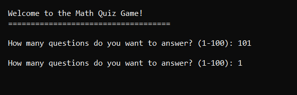
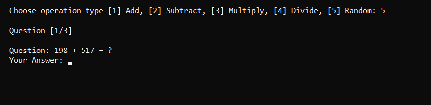
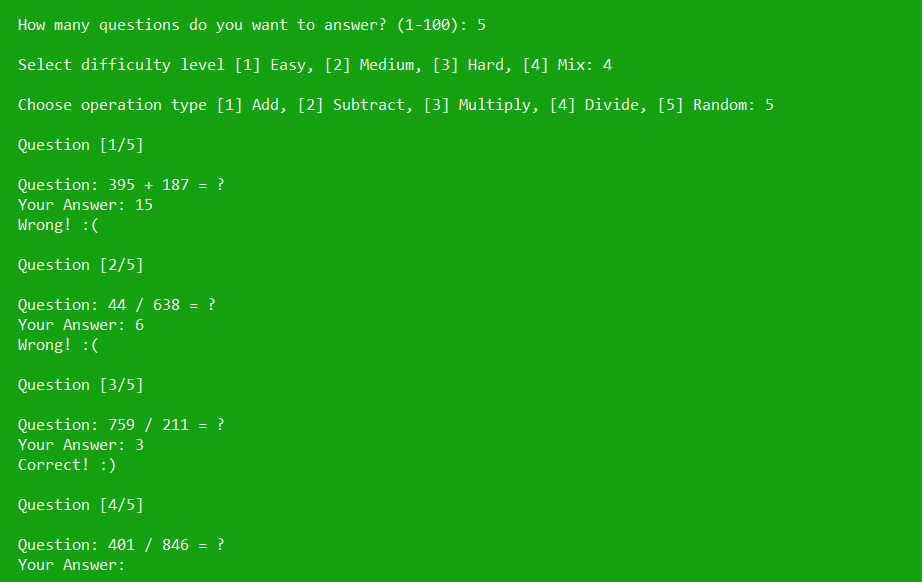
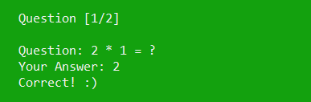
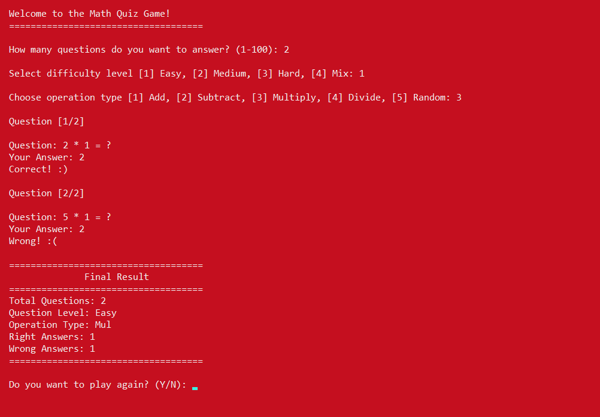

# Math Quiz Game

This C++ program implements a math quiz game where the player answers a series of randomly generated math questions. The game supports multiple difficulty levels and various types of operations, including addition, subtraction, multiplication, and division. The player receives feedback after each question, and the game tracks the number of correct and incorrect answers.

## Features:

- **Multiple Question Rounds:**  
  The player can select how many questions they want to answer (up to 100).

  

- **Question Levels:**  
  The player can choose from four difficulty levels: 
  - Easy (numbers between 1 and 10)  
  - Medium (numbers between 10 and 100)  
  - Hard (numbers between 100 and 1000)  
  - Mix (random numbers between 1 and 1000)

  

- **Operation Types:**  
  The player can select the type of math operation for the quiz, including:
  - Addition
  - Subtraction
  - Multiplication
  - Division
  - Mixed Operations (randomized)

  

- **Randomized Questions:**  
  The game generates random numbers based on the chosen difficulty level and asks the player to solve math problems of the chosen operation type.

  

- **Immediate Feedback:**  
  After answering each question, the game immediately tells the player whether their answer is correct (green background) or incorrect (red background).

  
  

- **Final Results:**  
  After completing all the questions, the game displays the total number of questions, the number of correct answers, and the number of incorrect answers.

  

## How to Play

1. Clone the repository to your local machine.
2. Compile the code using a C++ compiler.
3. Run the executable.
4. Follow the prompts to select the number of questions, difficulty level, and operation type.
5. Answer the questions and receive feedback after each one.
6. View the final results after completing all the questions.

## Example of Running the Game

```bash
How Many Questions do you want to answer? [1 - 100]: 5
Enter Question Level [1] Easy, [2] Medium, [3] Hard, [4] Mix: 2
Enter Operation Type [1] Add, [2] Subtract, [3] Multiply, [4] Divide, [5] Mixed: 1
